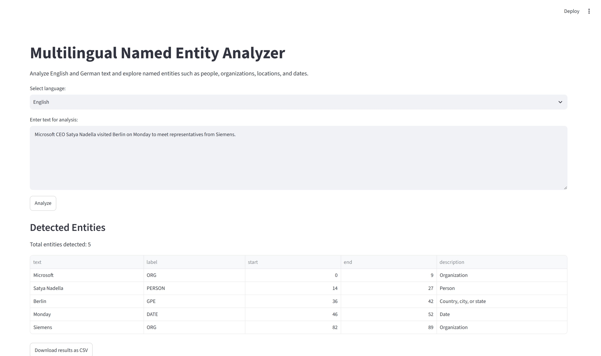

# Multilingual Named Entity Analyzer

A multilingual NLP application for detecting, highlighting, and analyzing named entities in English and German texts.

## Overview

The Multilingual Named Entity Analyzer is a Natural Language Processing (NLP) application built with Python, spaCy, and Streamlit.

The application identifies named entities such as people, organizations, locations, and dates in English and German texts. It also provides entity visualization, statistics, CSV export, and analysis history.

## Features

- Named Entity Recognition (NER)
- Support for English and German
- Entity highlighting in text
- Entity labels and descriptions
- Entity statistics and visualization
- CSV export of detected entities
- SQLite-based analysis history
- Interactive Streamlit interface
- Automated tests with pytest

## Application Preview



## Technologies

- Python
- spaCy
- Streamlit
- pandas
- SQLite
- pytest

## Project Structure

```text
multilingual-named-entity-analyzer/
│
├── app.py
├── ner_analyzer.py
├── database.py
├── requirements.txt
├── README.md
├── LICENSE
├── .gitignore
└── tests/
    └── test_ner_analyzer.py
```

## Installation

Clone the repository:

```bash
git clone https://github.com/gelareh-nazari/multilingual-named-entity-analyzer.git
cd multilingual-named-entity-analyzer
```

Create and activate a virtual environment.

On Windows:

```bash
python -m venv .venv
.venv\Scripts\activate
```

Install the required dependencies:

```bash
pip install -r requirements.txt
```

## Run the Application

Start the Streamlit application:

```bash
streamlit run app.py
```

Then open the local URL displayed by Streamlit in your browser.

## Testing

Run the automated tests with:

```bash
pytest
```

## How It Works

1. Select English or German.
2. Enter a text for analysis.
3. Click **Analyze**.
4. The application detects named entities using spaCy.
5. Detected entities are displayed with their labels and positions.
6. Entity statistics are visualized.
7. Results can be downloaded as a CSV file.
8. Previous analyses are stored in a local SQLite database.

## Future Improvements

Possible future extensions include:

- Support for additional languages
- More advanced NER models
- Improved entity visualization
- Entity filtering and search
- Additional NLP statistics
- Deployment as a public web application

## License

This project is licensed under the MIT License.
